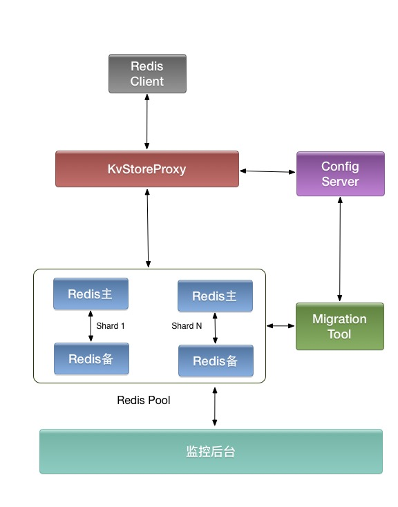

Kvstore
------------------------------
Kvstore is a proxy based Redis cluster solution written in C++

Why Another Redis Cluster Solution
----------------------------------
There are three open source Redis cluster solution as we known, so why another? Here are the main pain points:

* ### Twemproxy 
	* can not resharding without restarting cluster 
	* use only one thread so can not use multiple core in modern server machine
	
* ### Codis 
	* write in go so there is some GC problem, this is undesirable for a cache service, cause most requests will be served in less than 1 millisecond
	* need to change Redis source code, it's painful to update to the latest Redis version
	* it used much more memory than the original Redis server

* ### Redis Cluster 
	* need to update redis client driver
	* do not widely deployed in production
	* do not support commands with multiple keys. e.g. MSET, MGET

Feature
-------
* multiput thread to process client request
* pipeline 
* resharding without restarting cluster
* support most of redis commands, see [not-support-redis-cmd](doc/not-support-redis-cmd.md) for detailed commands
* key rewrite for batched deleting cache keys with TTL
* support two mode: 
	* cache mode - Redis node will be removed from the sharding nodes when it is failed
	* data-store mode - Slave Redis node will be promoted to master when the old master node failed

	
Architecture
------------

Benchmark
---------
need to be done in future

How to Build
------------
Kvstore can be compile under Linux with epoll and MacOS X with kqueue, kvstore need a C++ compiler with C++11 feature, no other dependencies are required. 

To compile the entire project, run the following commands

	$ ./build.sh version 1.0

This will generate a package named kvstore-1.0.tar.gz in the current directory

How to Setup a Test Environment
-------------------------------
Copy the build package to any directory, unzip it, run with command

	$ ./kv_store.sh start
	
If no error report in this command, then kvstore cluster is already runing in this machine. Use test_all to test that everything is OK
	
	$ ./test_all 

After test, use this command to shutdown the cluster
	
	$ ./kv_store.sh stop  
	

Have Fun!
---------------------

